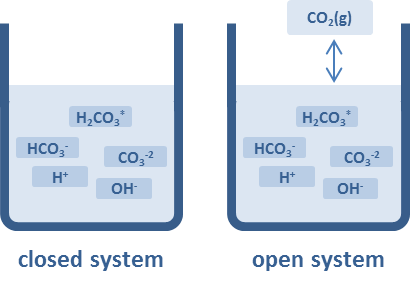

```{r install}
#install once, uncomment to update
#devtools::install_github("KopfLab/microbialkitchen")
#devtools::install_github("Kopflab/isocyclr")
#install.packages("vctrs")
#packageVersion("vctrs")
```

```{r load libraries, warning=FALSE, message=FALSE}
# load libraries
library(tidyverse)
library(isoreader)
library(isocyclr)
library(microbialkitchen)
library(RDocumentation)
library(vctrs)
```

```{r calc DIC}

speciation <- tibble(
                # pH_open = calculate_open_system_pH(qty(0.284, "atm")), 
                # alk_open = calculate_open_system_alkalinity(pH_open, qty(0.284, "atm")), 
                # DIC_open = calculate_DIC(pH_open, qty(0.284, "atm")), 
                # CA_open = calculate_carbonic_acid(pH_open, qty(0.284, "atm")), 
                # bicarb_open = calculate_bicarbonate(pH_open, qty(0.284, "atm")), 
                # carb_open = calculate_carbonate(pH_open, qty(0.284, "atm")), 
                #define equilibrium constants, pCO2, and pH - all defined for 25C
                    K_1 = 10^-1.47, # [CO2(aq)] / pCO2 
                    K_2 = 10^-6.35, # [HCO3 -][H+] / [CO2(aq)] ... note [CO2(aq)] assumed = to [H2CO3]
                    K_3 = 10^-10.33, # [CO3 2-][H+] / [HCO3 -]
                    pCO2_atm = 0.284,
                    pH = c(seq(0, 14, by = 0.5)),
                    C_H = 10 ^ (-pH),
                  
                  #calculate aqueous species concentrations
                    C_CO2_aq = K_1 * pCO2_atm ,
                    C_HCO3_aq = K_2 * C_CO2_aq / C_H,
                    C_CO3_aq = K_3 * C_HCO3_aq / C_H,
                    C_DIC = C_CO2_aq + C_HCO3_aq + C_CO3_aq,
                  
                  #define speciation fraction terms
                    f_CA = C_CO2_aq / C_DIC,
                    f_bicarb = C_HCO3_aq / C_DIC,
                    f_carb = C_CO3_aq / C_DIC,
                      test = f_CA + f_bicarb + f_carb
                  )

p_1 <- speciation %>% 
        pivot_longer(cols = c(C_DIC, C_CO2_aq, C_HCO3_aq, C_CO3_aq)) %>% 
            ggplot(aes(x = pH, y = value, color = name)) + 
              geom_line() +
            theme_bw() +
            scale_y_continuous(limits = c(10^-10, 10^3)) +
            xlim(0, 15)
p_1
```

# Isotopic Mass Balance
$$
\delta_T = \sum_i{f_i \cdot \delta_i} \\
\ \\
\delta_{DIC} = {\delta_{CA}} \cdot [CO_{2(g)}]+ {\delta_{bicarb} \cdot [HCO_{3(aq)}}] + {\delta_{carb}} \cdot [CO_{3(aq)}]\\
\ \\
{\delta_{carb}} = {\delta_{DIC}} - \frac{ \epsilon_{CO_{2(aq)}/HCO_{3}} \cdot [CO_{2(g)}] + \epsilon_{CO_{3}/HCO_{3}} \cdot [CO_{2(g)}]} {[DIC]} ... \text{from Zeebe and Wolf-Gladrow, 2001}\\
\ \\

\delta_{calcite} = \delta_{carb} + \epsilon_{carb \rightarrow calcite} \\
\ \\

$$

```{r}

isotopes <- tibble(
               # isotopic effects - temperature dependent
                      T.C = c(seq(0, 40, by = 5)),
                      T.K = T.C + 273.15,
               # calc isotopes for each DIC species
                d_CO2_g = 0, #permil
                d_CO2_aq = d_CO2_g + (1 / ((-373 / T.K) + 0.19)), # Mook (1986), CO2(g) to CO2(aq)
                d_HCO3_aq = d_CO2_aq + (-9866 / T.K + 24.12), # Mook (1986), CO2(aq) to HCO3
                d_CO3_aq = d_HCO3_aq + (1 / ((-867 / T.K) + 2.52)), #Mook (1986), HCO3 to CO3
                d_calcite_min = d_CO3_aq + (1 / 1.00542 - 1) * 1000 # alpha(calcite/carb)= 1.00542, Beck et al. 2015
                  )

isotopes %>% ggplot() +
    aes(x = )

```


# System Schematic
  We will explore an open system model of $\delta^{18}O$ of carboante speciation and the resulting calcite ($CaCO_3$) that precipiates out of the aqueous solution. Below is a plot of concentrations of carbonate species vs pH. $CO_2$ dissolves into water to create carbonic acid, $H_2CO_3$. As pH increases, the deprotonation of carbonic acid generates $HCO_3^{-}$ and $CO_3^{2-}$. 
  In an open system, the supply of $CO_2$ is considered "constant" because the reservior size of $CO_2$ (green line) in the atmosphere is much much larger than the reservior size of the dissolved $CO_2$ species. Regardless of pH and the speciation of the rest of the carbonate sequence, the $CO_2$ concentration remains the same, and therefore, the concentration of $H_2CO_3$ is independent of pH. 

```{r open system figure, out.width = "75%", echo=FALSE, eval=TRUE}
knitr::include_graphics("co2_open_speciation.png")

```

```{r speciation calc}
#speciation <- tibble(
                  #define equilibrium constants, pCO2, and pH - all defined for 25C
                    K_1 = 10^-1.47 # [CO2(aq)] / pCO2 
                    K_2 = 10^-6.35 # [HCO3 -][H+] / [CO2(aq)] ... note [CO2(aq)] assumed = to [H2CO3]
                    K_3 = 10^-10.33 # [CO3 2-][H+] / [HCO3 -]
                    pCO2_atm = 0.284
                    pH = 9 #c(seq(0, 14, by = 0.5))
                    C_H = 10 ^ (-pH)
                  
                  #calculate aqueous species concentrations
                    C_CO2_aq = K_1 * pCO2_atm 
                    C_HCO3_aq = K_2 * C_CO2_aq / C_H
                    C_CO3_aq = K_3 * C_HCO3_aq / C_H
                    C_DIC = C_CO2_aq + C_HCO3_aq + C_CO3_aq
                  
                  #define speciation fraction terms
                    f_CA = C_CO2_aq / C_DIC
                    f_bicarb = C_HCO3_aq / C_DIC
                    f_carb = C_CO3_aq / C_DIC
                  #)

##MAKE SPECATION PLOT BETTER
                    
# p_speciation <- speciation %>% 
#                 pivot_longer(
#                    cols = c(C_DIC, C_CO2_aq, C_HCO3_aq, C_CO3_aq)) %>% 
#                    #names_to = "var", values_to = "value") %>% 
#                   ggplot (aes(x = pH, y = value, color = name)) +
#                       geom_line() +
#                       #geom_line(aes(x = pH, y = C_CO2_aq)) +
#                       #geom_line(aes(x = pH, y = C_HCO3_aq)) +
#                       #geom_line(aes(x = pH, y = C_CO3_aq)) 
#                   lims(y_lim(10^-6, 10^2))
# p_speciation
```


# System Explanation

Let's set up a simplistic model to follow oxygen through a open system. There is one input flux, $CO_2$, diffusing into the water. The 3 aqueous carbonate species are the three internal nodes of the system. There is one output flux, $CaCO_3$, as calcite precipitates out of solution. 

```{r figures, out.width = "75%", echo=FALSE, eval=TRUE}
knitr::include_graphics("co2_open_speciation.png")  
knitr::include_graphics("fractfactor_carbspeciesbyT_Zeebe.png") 
```
# Exercise 1

### Exercise 1: take aways
  1) 
  2)

# Exercise 2: vary pCO2
 
### Exercise 2: take aways
  1) 
  2) 

# Exercise 3: vary temperature
 
### Exercise 3: take aways
  1) 
  2)


  

