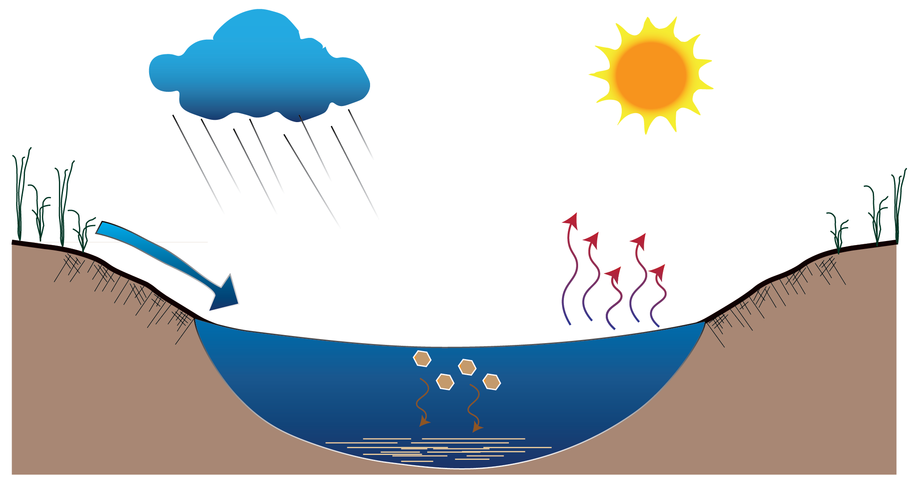

```{r install}
#install once, uncomment to update
devtools::install_github("KopfLab/microbialkitchen")
devtools::install_github("Kopflab/isocyclr")
```


```{r "setup", warning=FALSE, message=FALSE}
# load libraries
library(tidyverse)
library(isoreader)
library(isocyclr)
```

#System Schematic

Exploring a open, steady-state model of $\delta^{18}O_{min}$ of precipitated calcite within an aqueous solution. 

```{r out.width = "100%", echo=FALSE, eval=TRUE}
# 
```

#System Explanation
```{r}

O_isopath <- isopath() %>% 
              add_isotope("oxygen") %>% 
                add_component("gas", oxygen, variable = FALSE) %>% #in flux
                add_component("CA", oxygen) %>% 
                add_component("bicarb", oxygen) %>% 
                add_component("carb", oxygen) %>% 
                add_component("calcite", oxygen) %>% 
                add_component("calcite_out", oxygen, variable = FALSE) %>% #out flux
                  add_standard_reaction(gas == CA, eps.oxygen = e1, flux = atmo) %>% 
                  add_standard_reaction(CA == bicarb, eps.oxygen = e2, flux = atmo) %>% 
                  add_standard_reaction(bicarb == carb, eps.oxygen = e3, flux = atmo) %>% 
                  add_standard_reaction(carb == calcite, eps.oxygen = e4, flux = f4 * atmo) %>%  #f4 = fraction of carbonate ion that leaves to precip mineral
                  add_standard_reaction(calcite == calcite_out, eps.oxygen = 0, flux = f4 * atmo, name = "min out")
```

#### Schematic
```{r rxn_diagram, fig.width = 8, fig.height = 5}
O_isopath %>% generate_reaction_diagram() + coord_equal()
```
#### System of differential equations
```{r}
O_isopath %>% get_ode_matrix() %>% knitr::kable()
```


```{r out.width = "100%", echo=FALSE, eval=TRUE}
knitr::include_graphics("fractfactor_carbspeciesbyT_Zeebe.png") 
knitr::include_graphics("co2_open_speciation.png") 
```

#Assign Parameters
```{r}
O_isopath <- O_isopath %>% 
                  set_parameters(
                    tibble(
                    # define three scenarios to model
                      scenario = c("low atmo", "high atmo"),  #modeling pre-industrial pCO2, a 'greenhouse' climate pCO2 
                    # define flux values and fractions
                      atmo = c(280, 2800), 
                      f4 = 0.1, 
                    # isotopic effects - temperature dependent
                      T.C = 25,
                      T.K = T.C + 273.15,
                      e1 = (1 / ((-373 / T.K) + 0.19)), # Mook (1986), CO2(g) to CO2(aq)
                      e2 = (-9866 / T.K + 24.12), # Mook (1986), CO2(aq) to HCO3
                      e3 = (1 / ((-867 / T.K) + 2.52)), #Mook (1986), HCO3 to CO3     #(1/0.99318 - 1)*1000, # alpha(carb/bicarb)= 0.99318, Beck et al. 2015 
                      e4 = (1 / 1.00542 - 1) * 1000, # alpha(calcite/carb)= 1.00542, Beck et al. 2015
                    # define starting isotopic compositions
                      atmo.oxygen = 0, #atmoCO2 (pre-industrial) = 0permil. 
                      CA.oxygen = 0 , 
                      bicarb.oxygen = 0, 
                      carb.oxygen = 0, 
                      calcite.oxygen = 0 , 
                    # define pool sizes for variable component - pH = ? open system
                      atmo.pool = 1^-2,
                      CA.pool =  1/10^5,
                      bicarb.pool = 10^-0.5,
                      carb.pool = 1^-2.5
                    )
                  )

```

## Run model

Running the system of differential equations is easily done and uses the ode solvers of the **deSolve** package.

```{r, warning=FALSE}
model <- O_isopath %>% run_model(time_steps = 500)
```

#Knobs... i.e. parameters
```{r}

```

#Model Equation
```{r}

```

#Known, fixed, and dynamic parameters
```{r}

```

#Exercises 

#Exercise 1:
```{r}

```
#Exercise 2:
```{r}

```
#Exercise 3: 
```{r}

```
#Take Aways


