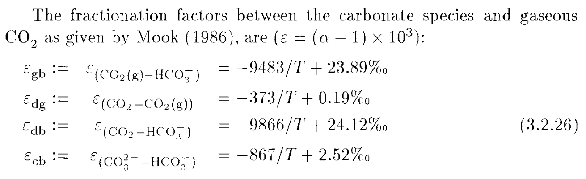
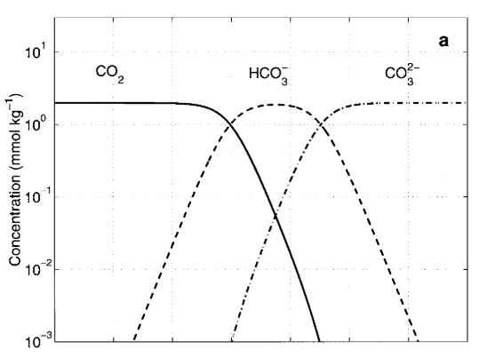

```{r install}
#install once, uncomment to update
#devtools::install_github("KopfLab/microbialkitchen")
#devtools::install_github("Kopflab/isocyclr")
#install.packages("vctrs")
#packageVersion("vctrs")
```

```{r load libraries, warning=FALSE, message=FALSE}
# load libraries
library(tidyverse)
library(isoreader)
library(isocyclr)
library(microbialkitchen)
library(RDocumentation)
library(vctrs)
```

# System Overview: Carbonate Speciation
  We are going to follow $\delta^{13}C$ as $CO_{2(g)}$ dissolves in water and carboante species form at equilibrium. Below are the reactions that describe the speciation of carbonate in aqueous solution. 

$$
CO_{2(g)} \rightleftharpoons CO_{2(aq)} \rightleftharpoons H^+ + HCO_{3(aq)}^{-} \rightleftharpoons H^+ + CO_{3(aq)}^{2-} \rightleftharpoons CaCO_{3(s)} \\
\ \\
K_H = \frac {CO_{2(aq)}} {pCO_2} = 10^{-1.47} \text {,  at 25C} \\
\ \\
K_1 = \frac {[H^+] [HCO_3^-]} {[H_2CO_3]} = 10^{-6.35} \text {,  at 25C} \\
\ \\
K_2 = \frac {[H^+] [CO_3^{2-}]} {[HCO_3^-]} = 10^{-10.33} \text {,  at 25C} \\
\ \\
DIC = [CO_{2(aq)}] + [HCO_3^-] + [CO_3^{2-}] \\
$$

# Scenario 1: Open System
```{r open system figure, out.width = "75%", echo=FALSE, eval=TRUE}
knitr::include_graphics("co2_open_speciation.png")
```
  Above is a plot of concentrations of carbonate species vs pH. $CO_2$ dissolves into water to create carbonic acid, $H_2CO_3$. As pH increases, the deprotonation of carbonic acid generates $HCO_3^{-}$ and $CO_3^{2-}$. In an open system, the supply of $CO_2$ is considered "constant" because the reservior size of $CO_2$ (green line) in the atmosphere is much much larger than the reservior size of the dissolved $CO_2$ species. Regardless of pH and the speciation of the rest of the carbonate sequence, the $CO_2$ concentration remains the same, and therefore, the concentration of $H_2CO_3$ is independent of pH. 

$$
\delta^{13}C_{CO_{2(g)}} = 0 \text{permil} \\
\ \\
\delta^{13}C_{CO_{2(aq)}}  = \delta^{13}C_{CO_{2(g)}} + \epsilon_{CO_{2(g)} \rightarrow CO_{2(aq)}} \\
\ \\ 
\delta^{13}C_{HCO_{3(g)}^-} = \delta^{13}C_{CO_{2(aq)}} + \epsilon_{CO_{2(aq)} \rightarrow {HCO_{3(aq)}^-}} \\
\ \\
\delta^{13}C_{CO_{3(aq)}^{2-}} = \delta^{13}C_{HCO_{3(aq)}^{-}} + \epsilon_{HCO_{3(aq)^{-}} \rightarrow CO_{3(aq)}^{2-}} \\
$$

### Question 1
Q: Before we model an open system at equilibrium: What parameters will we need to fix and which should we let vary?
  A:  
    - Fixed...
    - Variable...

```{r open system model}
isotopes_open <- tibble(
              # define temperature
                T.C = 25, #c(seq(0, 40, by = 5)),
                T.K = T.C + 273.15,
                
              # define fractionation factors - temperarture dependent
                e1 = (1 / ((-373 / T.K) + 0.19)), # Mook (1986), CO2(g) to CO2(aq)
                eps_db = (-9866 / T.K + 24.12), # Mook (1986), CO2(aq) to HCO3 . db
                eps_cb = (1 / ((-867 / T.K) + 2.52)), #Mook (1986), HCO3 to CO3 . cb
                e4 = (1 / 1.00542 - 1) * 1000, # alpha(calcite/carb)= 1.00542, Beck et al. 2015
                    
              #define equilibrium constants, pCO2, and pH - all for 25C
                K_H = 10^-1.47, # [CO2(aq)] / pCO2 
                K_1 = 10^-6.35, # [HCO3 -][H+] / [CO2(aq)] ... note [CO2(aq)] assumed = to [H2CO3]
                K_2 = 10^-10.33, # [CO3 2-][H+] / [HCO3 -]
                pCO2_atm = 10^-2,
                pH = c(seq(0, 14, by = 0.1)),
                C_H = 10 ^ (-pH),
                  
              # calculate aqueous species concentrations - rearrange equilibrium constant EQs to solve for [species of interest]
                C_CO2_aq = K_H * pCO2_atm,
                C_HCO3_aq = (K_1 * C_CO2_aq) / C_H,
                C_CO3_aq = (K_2 * C_HCO3_aq) / C_H,
                C_DIC = C_CO2_aq + C_HCO3_aq + C_CO3_aq,
              
              # define speciation fraction
                f_CA = C_CO2_aq / C_DIC,
                f_bicarb = C_HCO3_aq / C_DIC,
                f_carb = C_CO3_aq / C_DIC,
                  f_test = f_CA + f_bicarb + f_carb,
    #do question 2
    
              # calc isotopes for each DIC species
                d_CO2_g = 0, #permil
                d_CO2_aq = d_CO2_g + (1 / ((-373 / T.K) + 0.19)), # Mook (1986), CO2(g) to CO2(aq)
                d_HCO3_aq = d_CO2_aq + eps_db, (-9866 / T.K + 24.12), # Mook (1986), CO2(aq) to HCO3
                d_CO3_aq = d_HCO3_aq + eps_cb, #(1 / ((-867 / T.K) + 2.52)), #Mook (1986), HCO3 to CO3
                d_calcite_min = d_CO3_aq + (1 / 1.00542 - 1) * 1000, # alpha(calcite/carb)= 1.00542, Beck et al. 2015
                d_DIC = f_CA * d_CO2_aq + f_bicarb * d_HCO3_aq + f_carb * d_CO3_aq
                  )
```

### Question 2 
Q: Plot the carbonate speciation for the above open system at equilibrium.  
  A: 
  
```{r plot open speciation}
p_1 <- isotopes_open %>% 
          
p_1
```

```{r plot open isotopes}
p_2 <- isotopes_open %>% 
  pivot_longer(cols = c(d_CO2_g, d_CO2_aq, d_HCO3_aq, d_CO3_aq, d_calcite_min, d_DIC)) %>% 
    ggplot() +
      aes(x = pH, y = value, color = name) +
      geom_line(size = 1.1) +
      theme_bw() + theme(text = element_text(size = 13)) +
      scale_x_continuous(expand = c(0, 0)) +
      labs(y = "Concentration [M]", color = NULL, title = "Carbon Isotopes - Open System at Equilibrium")
p_2
```

### Question 3
Q: What do you observe about how the isotopic values of the carboante species vary with pH? 
  A: 

### Question 4
Q: What environment or natural setting does an open system model well?
  A: 
  
# Scenario 2: Closed System

## Isotopic Mass Balance

$$
\delta_T = \sum_i{f_i \cdot \delta_i} \\
\ \\
\delta_{DIC} = {\delta_{CA}} \cdot [CO_{2(g)}]+ {\delta_{bicarb} \cdot [HCO_{3(aq)}}] + {\delta_{carb}} \cdot [CO_{3(aq)}]\\
\ \\
{\delta_{HCO_{3}}} = {\delta_{DIC}} - \frac{ \epsilon_{CO_{2(aq)}/HCO_{3}} \cdot [CO_{2(g)}] + \epsilon_{CO_{3}/HCO_{3}} \cdot [CO_{3(aq)}^{2-}]} {[DIC]} ... \text{from Zeebe and Wolf-Gladrow, 2001}\\
\ \\
\delta_{CO_{2(aq)}} = \delta_{HCO_{3}} + \epsilon_{CO_{2(aq)}/HCO_{3}} \\
\ \\
\delta_{CO_{3(aq)}^{2-}} = \delta_{HCO_{3}} + \epsilon_{CO_{3}/HCO_{3}} \\
\ \\
\delta_{calcite} = \delta_{carb} + \epsilon_{carb \rightarrow calcite} \\
$$

```{r fract factor figure, out.width = "75%", echo=FALSE, eval=TRUE}
 #Mook 1986, C isotopes
```

### Question 5
Q: Before we model an open system at equilibrium: What parameters will we need to fix and which should we let vary?
  A: 
    - Fixed... 
    - Variable... 

```{r closed system model}
isotopes_closed <- tibble(
              # define temperature
                T.C = 25, #c(seq(0, 40, by = 5)),
                T.K = T.C + 273.15,
                
              # define fractionation factors - temperarture dependent
                e1 = (1 / ((-373 / T.K) + 0.19)), # Mook (1986), CO2(g) to CO2(aq)
                eps_db = (-9866 / T.K + 24.12), # Mook (1986), CO2(aq) to HCO3 . db
                eps_cb = (1 / ((-867 / T.K) + 2.52)), #Mook (1986), HCO3 to CO3 . cb 
                e4 = (1 / 1.00542 - 1) * 1000 , # alpha(calcite/carb)= 1.00542, Beck et al. 2015
                
              # calc speciation fractions         
                #define equilibrium constants, pCO2, and pH - all defined for 25C
                    K_H = 10^-1.47, # [CO2(aq)] / pCO2 
                    K_1 = 10^-6.35, # [HCO3 -][H+] / [CO2(aq)] ... note [CO2(aq)] assumed = to [H2CO3]
                    K_2 = 10^-10.33, # [CO3 2-][H+] / [HCO3 -]
                    #pCO2_atm = 10^-3,
                    pH = c(seq(0, 14, by = 0.1)),
                    C_H = 10 ^ (-pH),
              
              # fix DIC concentration available to system      
                    C_DIC = 10^-2, 
                  
              # calculate aqueous species concentrations
                    C_CO2_aq = (C_DIC * C_H^2) / (C_H^2 + K_1 * C_H + K_1 * K_2),
                    C_HCO3_aq = (C_DIC * K_1 * C_H) / (C_H^2 + K_1 * C_H + K_1 * K_2),
                    C_CO3_aq = (C_DIC * K_1 * K_2)/ (C_H^2 + K_1 * C_H + K_1 * K_2),
                
              # define speciation fraction terms
                    f_CA = C_CO2_aq / C_DIC,
                    f_bicarb = C_HCO3_aq / C_DIC,
                    f_carb = C_CO3_aq / C_DIC,
          
              # # calc isotopes for each DIC species
              #   d_CO2_g = 0, #permil
              #   d_CO2_aq = d_CO2_g +  (1 / ((-373 / T.K) + 0.19)), # Mook (1986), CO2(g) to CO2(aq)
              #   d_HCO3_aq = d_CO2_aq +  (-9866 / T.K + 24.12), # Mook (1986), CO2(aq) to HCO3
              #   d_CO3_aq = d_HCO3_aq +  (1 / ((-867 / T.K) + 2.52)), #Mook (1986), HCO3 to CO3
              #   d_calcite_min = d_CO3_aq + (1 / 1.00542 - 1) * 1000, # alpha(calcite/carb)= 1.00542, Beck et al. 2015
              #   d_DIC = f_CA * d_CO2_aq + f_bicarb * d_HCO3_aq + f_carb * d_CO3_aq,
              # 
              # calc isotopes using Zeebe EQs
              d_DIC = 0,
              d_bicarb = d_DIC - eps_db * f_CA - eps_cb * f_carb,
              d_CA = d_bicarb + eps_db,
              d_carb = d_bicarb + eps_cb, 
              d_DIC_test = f_CA * d_CA + f_bicarb * d_bicarb + f_carb * d_carb, #Activity 2
              d_calcite_min = d_carb + (1 / 1.00542 - 1) * 1000 # alpha(calcite/carb)= 1.00542, Beck et al. 2015
                )
```

``` {r plot closed speciation}
p_3 <- isotopes_closed %>% 
          pivot_longer(cols = c(C_CO2_aq, C_HCO3_aq, C_CO3_aq, C_H)) %>% 
        ggplot() +
            aes(x = pH, y = value, color = name) +
          geom_line(size = 1.1) + 
            scale_y_log10() +
          theme_bw() + theme(text = element_text(size = 13)) +
          scale_x_continuous(expand = c(0, 0)) +
          labs(y = "Concentration [M]", color = NULL, title = "Speciation - Closed System at Equilibrium")
p_3
```

```{r closed system figure, out.width = "65%", echo=FALSE, eval=TRUE}
 #from from Zeebe and Wolf-Gladrow, 2001
```

``` {r plot closed isotopes}
p_4 <- isotopes_closed %>% 
  pivot_longer(cols = c(d_DIC, d_bicarb, d_CA, d_carb, d_calcite_min)) %>% 
    ggplot() +
      aes(x = pH, y = value, color = name) +
      geom_line(size = 1.1) +
      theme_bw() + theme(text = element_text(size = 13)) +
      scale_x_continuous(expand = c(0, 0)) +
      labs(y = "Concentration [M]", color = NULL, title = "Carbon Isotopes - Closed System at Equilibrium")
p_4
```
### Question 6
Q: What do you observe about how the isotopic values of the carboante species vary with pH? 
  A: 
  
### Question 7
Q: What environment or natural setting does a closed system model well?
  A:  


