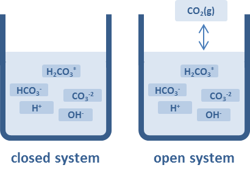

```{r install}
#install once, uncomment to update
#devtools::install_github("KopfLab/microbialkitchen")
#devtools::install_github("Kopflab/isocyclr")
#install.packages("vctrs")
#packageVersion("vctrs")
```

```{r load libraries, warning=FALSE, message=FALSE}
# load libraries
library(tidyverse)
library(isoreader)
library(isocyclr)
library(microbialkitchen)
library(RDocumentation)
library(vctrs)
```

# System Schematic
  We will explore an open system model of $\delta^{18}O$ of carboante speciation and the resulting calcite ($CaCO_3$) that precipiates out of the aqueous solution. Below is a plot of concentrations of carbonate species vs pH. $CO_2$ dissolves into water to create carbonic acid, $H_2CO_3$. As pH increases, the deprotonation of carbonic acid generates $HCO_3^{-}$ and $CO_3^{2-}$. 
  In an open system, the supply of $CO_2$ is considered "constant" because the reservior size of $CO_2$ (green line) in the atmosphere is much much larger than the reservior size of the dissolved $CO_2$ species. Regardless of pH and the speciation of the rest of the carbonate sequence, the $CO_2$ concentration remains the same, and therefore, the concentration of $H_2CO_3$ is independent of pH. 

```{r open system figure, out.width = "75%", echo=FALSE, eval=TRUE}
knitr::include_graphics("co2_open_speciation.png")

```

```{r speciation calc}
#speciation <- tibble(
                  #define equilibrium constants, pCO2, and pH - all defined for 25C
                    K_1 = 10^-1.47 # [CO2(aq)] / pCO2 
                    K_2 = 10^-6.35 # [HCO3 -][H+] / [CO2(aq)] ... note [CO2(aq)] assumed = to [H2CO3]
                    K_3 = 10^-10.33 # [CO3 2-][H+] / [HCO3 -]
                    pCO2_atm = 0.284
                    pH = 9 #c(seq(0, 14, by = 0.5))
                    C_H = 10 ^ (-pH)
                  
                  #calculate aqueous species concentrations
                    C_CO2_aq = K_1 * pCO2_atm 
                    C_HCO3_aq = K_2 * C_CO2_aq / C_H
                    C_CO3_aq = K_3 * C_HCO3_aq / C_H
                    C_DIC = C_CO2_aq + C_HCO3_aq + C_CO3_aq
                  
                  #define speciation fraction terms
                    f_CA = C_CO2_aq / C_DIC
                    f_bicarb = C_HCO3_aq / C_DIC
                    f_carb = C_CO3_aq / C_DIC
                  #)

##MAKE SPECATION PLOT BETTER
                    
# p_speciation <- speciation %>% 
#                 pivot_longer(
#                    cols = c(C_DIC, C_CO2_aq, C_HCO3_aq, C_CO3_aq)) %>% 
#                    #names_to = "var", values_to = "value") %>% 
#                   ggplot (aes(x = pH, y = value, color = name)) +
#                       geom_line() +
#                       #geom_line(aes(x = pH, y = C_CO2_aq)) +
#                       #geom_line(aes(x = pH, y = C_HCO3_aq)) +
#                       #geom_line(aes(x = pH, y = C_CO3_aq)) 
#                   lims(y_lim(10^-6, 10^2))
# p_speciation
```


# System Explanation

Let's set up a simplistic model to follow oxygen through a open system. There is one input flux, $CO_2$, diffusing into the water. The 3 aqueous carbonate species are the three internal nodes of the system. There is one output flux, $CaCO_3$, as calcite precipitates out of solution. 

```{r model components and rxns}
O_isopath <- isopath() %>% 
              add_isotope("oxygen") %>% 
                add_component("gas", oxygen, variable = FALSE) %>% #Atmospheric CO2 in flux
                add_component("CA", oxygen) %>% #carbonic acid node
                add_component("bicarb", oxygen) %>% #bicarbonate anion node
                add_component("carb", oxygen) %>% #carboante anion node
                add_component("calcite", oxygen) %>% #calcite mineral node
                add_component("calcite_out", oxygen, variable = FALSE) %>% #out flux, mineral precipitation 
                  add_standard_reaction(gas == CA, eps.oxygen = e1, flux = atmo, name = "gas in") %>% 
                  add_standard_reaction(CA == bicarb, eps.oxygen = e2, flux = f2 * atmo) %>% 
                  add_standard_reaction(bicarb == carb, eps.oxygen = e3, flux = f3 *atmo) %>% 
                  add_standard_reaction(carb == calcite, eps.oxygen = e4, flux = f4 * atmo) %>%
                  add_standard_reaction(calcite == calcite_out, eps.oxygen = 0, flux = f4 * atmo, name = "min out")
```

```{r rxn diagram, fig.width = 8, fig.height = 5}
O_isopath %>% generate_reaction_diagram() + coord_equal()
```

# Model Assumptions
1) Assume instantaneous equilibration between aqueous carboante ion species. 
2) The only source of oxygen in this system is $CO_2$

# Basic Model Equations
$$
\ \\
\text {generic} \\
\frac{d(\delta^{18}O)} {dt} = \sum_{in} \big( \delta^{18}O_{in} + \epsilon_{in \rightarrow aq} \big) \phi_{in \rightarrow aq} - \sum_{out} \big( \delta^{18}O_{out} + \epsilon_{aq \rightarrow out} \big) \phi_{aq \rightarrow out}  \\
\ \\

\text {carbonic acid} \\ 
\frac{d(\delta^{18}O_{CA})} {dt} = \big( \delta^{18}O_{gas} + \epsilon_{gas \rightarrow CA} \big) \phi_{gas \rightarrow CA} - \big( \delta^{18}O_{bicarb} + \epsilon_{CA \rightarrow bicarb} \big) \phi_{CA \rightarrow bicarb}  \\
\ \\

\text {bicarbonate} \\
\frac{d(\delta^{18}O_{bicarb})} {dt} = \big( \delta^{18}O_{CA} + \epsilon_{CA \rightarrow bicarb} \big) \phi_{CA \rightarrow bicarb} - \big( \delta^{18}O_{carb} + \epsilon_{bicarb \rightarrow carb} \big) \phi_{bicarb \rightarrow carb}  \\
\ \\

\text {carbonate} \\
\frac{d(\delta^{18}O_{carb})} {dt} = \big( \delta^{18}O_{bicarb} + \epsilon_{bicarb \rightarrow carb} \big) \phi_{bicarb \rightarrow carb} - \big( \delta^{18}O_{calcite} + \epsilon_{carb \rightarrow calcite} \big) \phi_{carb \rightarrow calcite}  \\
\ \\
$$

```{r rxn equations}
O_isopath %>% get_ode_matrix() %>% knitr::kable()
```

```{r figures, out.width = "75%", echo=FALSE, eval=TRUE}
knitr::include_graphics("co2_open_speciation.png")  
knitr::include_graphics("fractfactor_carbspeciesbyT_Zeebe.png") 
```

# Exercise 1: Pre-Industrial pCO2
  For the first scenario, let's examine an open system with $pCO_2$ values approximately at 'pre-industrial' levels, ~280ppm. pH is fixed at 9 (see chunk 4: speciation calc) and temperature of the system is constant at 25C. 
  
```{r exercise 1, fig.width = 8, fig.height = 6}
# Knobs: Assign Parameters
O_isopath <- O_isopath %>% 
                  set_parameters(
                    tibble(
                    # define scenarios to model
                      scenario = c("pre-industrial"),  
                    # define flux values and fractions
                      atmo = c(0.284),  
                      f2 = 0.1,
                      f3 = 0.1,
                      f4 = 0.1, 
                    # isotopic effects - temperature dependent
                      T.C = 25,
                      T.K = T.C + 273.15,
                      e1 = (1 / ((-373 / T.K) + 0.19)), # Mook (1986), CO2(g) to CO2(aq)
                      e2 = (-9866 / T.K + 24.12), # Mook (1986), CO2(aq) to HCO3
                      e3 = (1 / ((-867 / T.K) + 2.52)), #Mook (1986), HCO3 to CO3
                      e4 = (1 / 1.00542 - 1) * 1000, # alpha(calcite/carb)= 1.00542, Beck et al. 2015
                    # define starting isotopic compositions
                      gas.oxygen = 0, #atmoCO2 (pre-industrial) = 0permil. 
                      CA.oxygen = 0 , 
                      bicarb.oxygen = 0, 
                      carb.oxygen = 0, 
                      calcite.oxygen = 0 , 
                    # define pool sizes for variable component - pH = 7 open system
                      gas = atmo,
                      CA =  C_CO2_aq,
                      bicarb = C_HCO3_aq,
                      carb = C_CO3_aq, 
                      calcite = 1^-5
                    )
                  )

#Run model scenarios
O_model <- O_isopath %>% run_model(time_steps = 1000)

# Plot model through time
p_1 <- O_model %>% 
          pivot_longer(names_to = "node", values_to = "delta", ends_with("oxygen")) %>%
  ggplot() + 
    aes(time, delta, color = node,  ) +
  geom_line(size = 1) + theme_bw() +
    labs(y = expression(delta^18*'O')) +
  facet_grid(~scenario)
p_1
```

### Exercise 1: take aways
Q: What do you observe about the this initial model scenario? Which species are enriched (and in what?)?

A:
  1) Calcite is the most enriched in $^{18}O$ of the species, demonstrating that it is energetically favorable for the heavier isotope to 'sort' into the solid state bonds. 
  2) All aqueous species become enriched in $^{18}O$ compared to $CO_{2(g)}$. 
  3) Dissolution of $CO_{2(g)}$ into water to form $CO_{2(aq)$ (i.e. $H_2CO_{3(aq)}$) generates very little fractionation, using the epsilon values from Mook et al. 1986.

# Exercise 2: vary pCO2
  For exercise 2, let's allow $pCO_2$ to vary to simulate pre-industrial conditions, in addition to, estimated $pCO_2$ for the Cretaceous Aptian/Albian transition (~113 Ma) when the planet was in a "greenhouse" climate state, and for the Paleocene-Eocene Thermal Maximum (~55 Ma) which was a large perturbation in global (?) climate.

```{r exercise 2, vary CO2}
# Define new parameters

#pCO2 levels for 3 scenarios. 
    #1) pre-industrial modern pCO2 levels: 280 ppm (2.8E-4 atm, 0.284 mbar)
    #2) Cretaceous Aptian/Albian transition (113 Ma): ~1500 ppm (1.5E-3 tm, 1.5 mbar) (Huber et al., 2018)
    #3) PETM, 800 ppm (8E-4 atm, 0.811 mbar), but note that estimate range from 650 to 3500 ppm (Carmichael et al., 2016)
            #https://paleo-co2.org/

O_isopath_varyCO2 <- O_isopath %>% 
                  set_parameters(
                    tibble(
                    # define scenarios to model
                      scenario = c("pre-indust", "113 Ma", "55 Ma"), #modeling pre-industrial pCO2, Creteceous'greenhouse' climate pCO2, and PETM
                    # define flux values and fractions
                      atmo = c(0.284, 1.5, 0.811),  
                      f2 = 0.1,
                      f3 = 0.1,
                      f4 = 0.1, 
                    # isotopic effects - temperature dependent
                      T.C = 25,
                      T.K = T.C + 273.15,
                      e1 = (1 / ((-373 / T.K) + 0.19)), # Mook (1986), CO2(g) to CO2(aq)
                      e2 = (-9866 / T.K + 24.12), # Mook (1986), CO2(aq) to HCO3
                      e3 = (1 / ((-867 / T.K) + 2.52)), #Mook (1986), HCO3 to CO3     #(1/0.99318 - 1)*1000, alpha(carb/bicarb)= 0.99318, Beck et al. 2015 
                      e4 = (1 / 1.00542 - 1) * 1000, # alpha(calcite/carb)= 1.00542, Beck et al. 2015
                    # define starting isotopic compositions
                      gas.oxygen = 0, #atmoCO2 (pre-industrial) = 0permil. 
                      CA.oxygen = 0 , 
                      bicarb.oxygen = 0, 
                      carb.oxygen = 0, 
                      calcite.oxygen = 0 , 
                    # define pool sizes for variable component - pH = 7 open system
                      gas = atmo,
                      CA =  C_CO2_aq,
                      bicarb = C_HCO3_aq,
                      carb = C_CO3_aq, 
                      calcite = 1^-5
                    )
                  )
  
O_model_varyCO2 <- O_isopath_varyCO2 %>% run_model(time_steps = 500)

p_2 <- O_model_varyCO2 %>% 
          pivot_longer(names_to = "node", values_to = "delta", ends_with("oxygen")) %>%
  ggplot() + 
    aes(time, delta, color = node, size = ) +
  geom_line() + theme_bw() +
    labs(y = expression(delta^18*'O')) +
  facet_grid(~scenario)
p_2
```

### Exercise 2: take aways
  1) 
  2) 

# Exercise 3: vary temperature
  According to Henry's Law, the temperature of a system affects the solubility of $CO_2$ in aqueous solution.$CO_2$ is inversely soluable in water, meaning that as temperature increases, the amount off $CO_2$ that can be dissolved in water decreases. 
  
```{r exercise 3, vary temp}
#define new parameters
solubility <- tibble(
  temp = seq(from = 0, to = 50, by = 1) %>% qty("C"),
  solubility = calculate_gas_solubility("CO2", temp)
)
#Henry's law explanation?? or let that be a Q the could ask me?

O_isopath_varyTemp <- O_isopath %>% 
                  set_parameters(
                    tibble(
                    # define scenarios to model
                      scenario = c("15C", "25C", "35C"),  
                    # define flux values and fractions
                      atmo = c(0.284),  
                      f2 = 0.1,
                      f3 = 0.1,
                      f4 = 0.1, 
                    # isotopic effects - temperature dependent
                      T.C = c(15, 25, 35),
                      T.K = T.C + 273.15,
                      e1 = (1 / ((-373 / T.K) + 0.19)), # Mook (1986), CO2(g) to CO2(aq)
                      e2 = (-9866 / T.K + 24.12), # Mook (1986), CO2(aq) to HCO3
                      e3 = (1 / ((-867 / T.K) + 2.52)), #Mook (1986), HCO3 to CO3     #(1/0.99318 - 1)*1000, alpha(carb/bicarb)= 0.99318, Beck et al. 2015 
                      e4 = (1 / 1.00542 - 1) * 1000, # alpha(calcite/carb)= 1.00542, Beck et al. 2015
                    # define starting isotopic compositions
                      gas.oxygen = 0, #atmoCO2 (pre-industrial) = 0permil. 
                      CA.oxygen = 0 , 
                      bicarb.oxygen = 0, 
                      carb.oxygen = 0, 
                      calcite.oxygen = 0 , 
                    # define pool sizes for variable component - pH = 7 open system
                      gas = atmo,
                      CA =  C_CO2_aq,
                      bicarb = C_HCO3_aq,
                      carb = C_CO3_aq, 
                      calcite = 1^-5
                    )
                  )

#Run model scenarios
O_model_varyTemp <- O_isopath_varyTemp %>% run_model(time_steps = 1000)

# Plot model through time
p_3 <- O_model_varyTemp %>% 
          pivot_longer(names_to = "node", values_to = "delta", ends_with("oxygen")) %>%
  ggplot() + 
    aes(time, delta, color = node) +
  geom_line(size = 1) + theme_bw() +
    labs(y = expression(delta^18*'O')) +
  facet_grid(~scenario)
p_3
```

### Exercise 3: take aways
  1) 
  2)

# Exercise 4: Let pCO2 set the pH
  For the last exercise, let's allow the pH of the system to be determined by the initial conditon of the $pCO_2$. We will use the same 3 $pCO_2$ scenarios as in exercise 2 and examine a range of temperatures from 0 to 35C. 
```{r exercise 4}
# Temperature range
temps <- tibble(
            temps = qty(c(seq(0,35, by = 5)), "C")
               )

pCO2s <- tibble(
            pCO2 = qty(c(0.284, 1.5, 0.811), "mbar")
                )

# calculate for all combinations
pH_vs_pCO2 <-
  crossing(pCO2s, temps) %>%
  mutate(
    pH = calculate_open_system_pH(pCO2, temp = temps),
    DIC = calculate_DIC(pH, pCO2, temp = temps),
    CO2 = calculate_ideal_gas_molarity(pCO2, temp = temps)
  )

p_4 <- pH_vs_pCO2 %>%
         # pivoting longer mixed data types requires explicit units first
        make_qty_units_explicit(DIC = "mM", CO2 = "mM") %>%
        pivot_longer(
          cols = c(pH, `DIC [mM]`, `CO2 [mM]`), 
          names_to = "var", values_to = "value"
        ) %>%
        mutate(temperature = as_factor(temps, unit = "C")) %>%
          ggplot(aes(pCO2, value, color = temperature)) +
            geom_point() +
            geom_line() +
              scale_x_qty(expand = c(0, 0)) +
              facet_grid(var~., scales = "free_y") +
              expand_limits(x = 0) +
              theme_bw() + 
              labs(y = NULL)
p_4
```

# Exercise 4, Take Aways
1) Most natural waters have pHs between 5.5 and 8.5. Our modeled system does not get above 5.7. This implies that other aqueous species must be in system to increase the pH of a system, beyond just dissolving $CO_2$ from the atmosphere. Ex: naturally occuring bases ($NaOH$).
2) 


```{r spare parts}
# gas.pool = 1^-2
# CA.pool =  1 / 1^5
# bicarb.pool = 1^-0.5
# carb.pool = 1^-2.5
# calcite.pool = 1^-3

# O_isopath_varyCO2 <- O_isopath %>% 
#                   set_parameters(
#                     tibble(
#                     # define scenarios to model
#                       scenario = c("pre-indust", "113 Ma", "55 Ma"), #modeling pre-industrial pCO2, Creteceous'greenhouse' climate pCO2, and PETM
#                     # define flux values and fractions
#                       atmo = c(0.284, 1.5, 0.811),  
#                       f2 = 0.1,
#                       f3 = 0.1,
#                       f4 = 0.1, 
#                     # calc DIC species
#                       calculate_DIC(
#                         pH = 7, #adjust pH to system
#                         pCO2 = qty(c(0.284, 1.5, 0.811), "mbar") 
#                         ),
#                     # isotopic effects - temperature dependent
#                       T.C = 25,
#                       T.K = T.C + 273.15,
#                       e1 = (1 / ((-373 / T.K) + 0.19)), # Mook (1986), CO2(g) to CO2(aq)
#                       e2 = (-9866 / T.K + 24.12), # Mook (1986), CO2(aq) to HCO3
#                       e3 = (1 / ((-867 / T.K) + 2.52)), #Mook (1986), HCO3 to CO3     #(1/0.99318 - 1)*1000, alpha(carb/bicarb)= 0.99318, Beck et al. 2015 
#                       e4 = (1 / 1.00542 - 1) * 1000, # alpha(calcite/carb)= 1.00542, Beck et al. 2015
#                     # define starting isotopic compositions
#                       gas.oxygen = 0, #atmoCO2 (pre-industrial) = 0permil. 
#                       CA.oxygen = 0 , 
#                       bicarb.oxygen = 0, 
#                       carb.oxygen = 0, 
#                       calcite.oxygen = 0 , 
#                     # define pool sizes for variable component - pH = ? open system
#                       gas = gas.pool, #1^-2,
#                       CA =  CA.pool, #1 / 1^5,
#                       bicarb = bicarb.pool,  #1^-0.5,
#                       carb = carb.pool, #1^-2.5, 
#                       calcite = calcite.pool, #1^-3
#                     )
#                   )
```